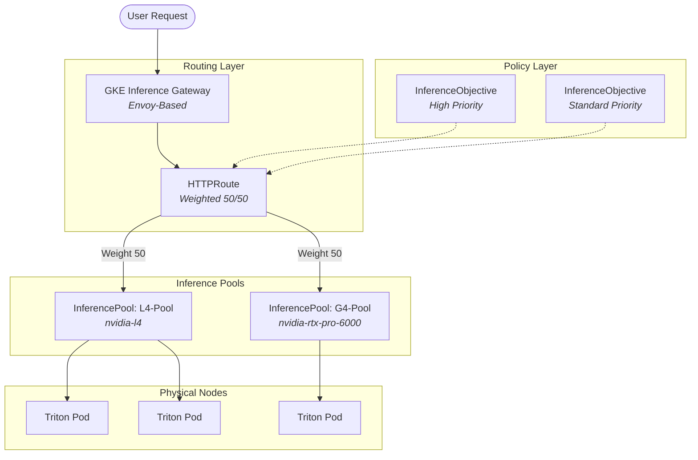

---

## 3. GKE Inference Gateway Architecture

The GKE Inference Gateway extends the Kubernetes Gateway API to make it "AI-aware." It sits between the user and your heterogeneous GPU pools, making routing decisions based on model health rather than just network health.

### Architecture Diagram



### Component Descriptions

| Component | Description |
| :--- | :--- |
| **Gateway** | The managed entry point (Load Balancer). In GKE, this is an Envoy-based proxy that handles SSL, identity, and the initial connection. |
| **HTTPRoute** | The routing "brain." It defines rules (Paths like `/v2/models/dlrm`) and directs them to backends. In this project, it performs the **Weighted Split** between our two different GPU families. |
| **InferencePool** | A logical grouping of model server Pods. Unlike a standard Service, an `InferencePool` allows the Gateway to see **Inference-specific health** (e.g., is the model loaded? is the KV cache full?). It enforces homogeneity: all pods in one pool should have the same GPU type. |
| **InferenceObjective** | The service-level policy. It maps specific traffic (via headers like `x-gateway-inference-objective`) to performance targets. It allows you to prioritize "Premium" user requests over "Batch" requests when GPU resources are scarce. |

---

## 4. Verification & Troubleshooting Commands

### Hardware Verification
To verify that your pod is actually utilizing the specific GPU family defined in your `ComputeClass`:

```bash
# Check the G4 (RTX 6000 Ada) Pod
kubectl exec $(kubectl get pods -l app=triton-g4 -o name | head -n 1) -- nvidia-smi

# Check the L4 Pod
kubectl exec $(kubectl get pods -l app=triton-l4 -o name | head -n 1) -- nvidia-smi
```

### Scaling Verification
To see why a pod is stuck in `Pending` (crucial for detecting G4 stockouts):

```bash
# View autoscaler decision logs
kubectl get events -n kube-system --sort-by='.lastTimestamp'

# View HPA metrics calculation
kubectl describe hpa triton-g4-hpa
```

When optimizing GPU obtainability using GKE Compute Classes (CCC), a common initial thought is to use **Hardware Fallback** (e.g., "Give me an L4, but fall back to a T4/G4 if L4 is out of stock") within a single deployment.

**Why this breaks GKE Inference Gateway:**
The Inference Gateway (and the `InferencePool` resource it routes to) assumes that all Pods within a single pool have **homogeneous performance characteristics**. The Gateway uses sophisticated mathematical models based on real-time metrics (like KV cache or queue depth) to predict latency and route traffic optimally. 

If an `InferencePool` contains a mix of L4s (24GB VRAM, 300GB/s bandwidth) and G4s (48GB VRAM, 960GB/s bandwidth):
*   **Predictability is destroyed:** The Gateway's latency predictions will be wildly inaccurate.
*   **Out-Of-Memory (OOM) Crashes:** A request requiring 30GB of VRAM will succeed on the G4 but crash the L4. The Gateway doesn't know the physical hardware of the underlying pod, only the metrics it exports.

**The Solution: Fallback via Routing, not Provisioning**
1.  **Strict ComputeClasses:** We define `l4-class` and `g4-class` with `whenUnsatisfiable: DoNotScaleUp`. This ensures nodes are exactly what we expect.
2.  **Isolated Pools:** We deploy `Deployment-L4` and `Deployment-G4` into separate `InferencePools`.
3.  **Intelligent Routing:** We use the Gateway `HTTPRoute` to distribute traffic across the pools. If the L4 zone stocks out, its deployment won't scale, and the Gateway will naturally shift the overflow traffic to the G4 pool which *can* scale.

---

## 2. Scaling Considerations for RecML (DLRM)

Scaling inference servers (like NVIDIA Triton) running Deep Learning Recommendation Models (DLRM) requires a different approach than standard microservices. DLRMs are typically **Memory-Bandwidth Bound** due to massive embedding table lookups, rather than purely compute-bound.

### The Bad: CPU Utilization
Scaling on CPU (e.g., targeting 20% CPU) is highly inefficient for GPU inference.
*   **Reason:** The CPU acts merely as a dispatcher (receiving the HTTP request, formatting the tensor, sending it to the GPU). 
*   **Result:** The GPU can be at 100% saturation, completely blocking new requests, while the container CPU sits idle at 4%. The HPA will never trigger, and requests will time out.

### The Better: GPU Duty Cycle
Scaling on GPU metrics (e.g., `kubernetes.io|container|accelerator|duty_cycle`) accurately measures hardware saturation.
*   **Reason:** It tracks the percentage of time the GPU CUDA cores are actively processing data.
*   **Setup:** Requires installing the `custom-metrics-stackdriver-adapter` in GKE Standard.

### The Gold Standard: Queue Depth / Pending Requests
The most efficient way to scale an inference server is based on the **User Experience**—specifically, how many requests are waiting in line.
*   **Metric:** `nv_inference_pending_request_count` (exported by Triton).
*   **Reason:** If Triton has 10 requests sitting in the queue, latency is increasing. It doesn't matter if the GPU is at 50% or 100% utilization; the system needs more replicas to clear the backlog.
*   **Setup:** Uses GKE Managed Prometheus (`PodMonitoring`) to scrape the metric and the Custom Metrics adapter to expose it to the HPA. This triggers scale-up *before* hardware saturation causes critical latency spikes.
