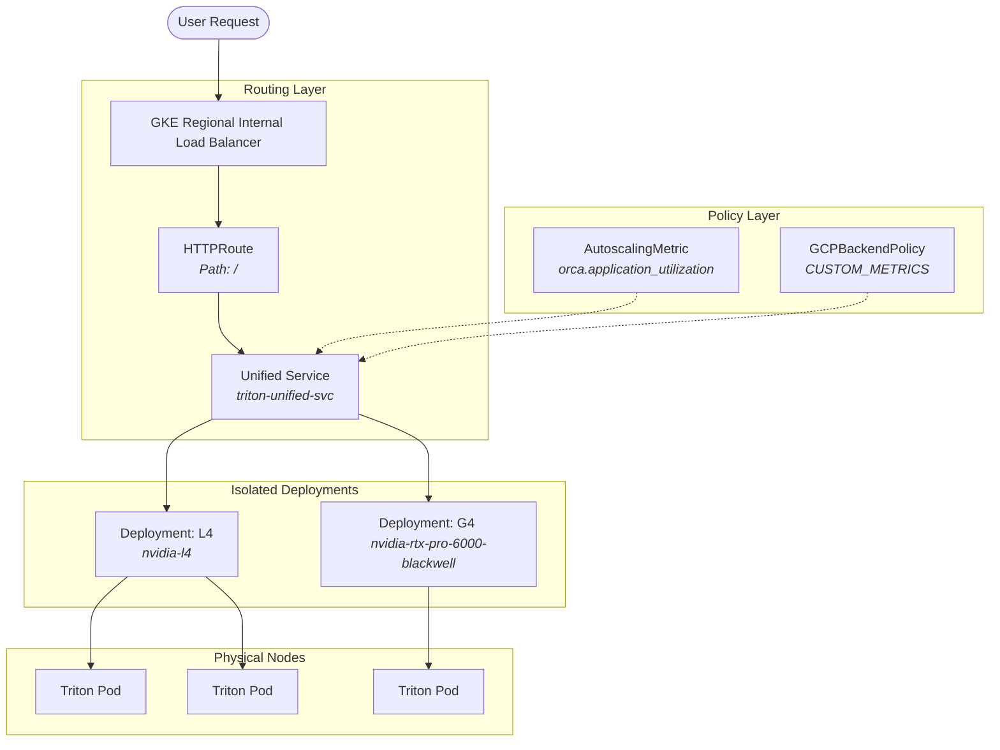

# Architecture and Scaling Considerations

## 1. The Logic of a Unified Service for GKE UBB Spillover

When optimizing GPU obtainability using GKE Compute Classes (CCC), a common initial thought is to use **Hardware Fallback** (e.g., "Give me an L4, but fall back to a G4 if L4 is out of stock") within a single deployment.

**Why this breaks Load Balancing Predictions:**
If an autoscaler mixes L4s (24GB VRAM) and G4s (96GB GDDR7 VRAM) into a single ReplicaSet, it is impossible to scale them independently. 

**The Solution: Independent Deployments, Unified Service**
1.  **Strict ComputeClasses:** We define `l4-class` and `g4-class` with `whenUnsatisfiable: DoNotScaleUp`. This ensures nodes are exactly what we expect.
2.  **Isolated Deployments:** We deploy `Deployment-L4` and `Deployment-G4` so their HPAs can scale them independently based on load.
3.  **Unified Service:** Both deployments share a common label (e.g., `app.kubernetes.io/name: triton-inference`). A single Kubernetes `Service` selects this label, combining both the L4 and G4 pods into a unified backend.
4.  **Intelligent Routing (UBB):** We apply a `GCPBackendPolicy` using **Utilization-Based Balancing (UBB)** to this unified service. The Regional Load Balancer natively reads the `queue_depth` metric from every pod. If the G4 pods hit capacity, the Load Balancer natively and instantly sheds the overflow traffic to the L4 pods within the same service, entirely bypassing the need for experimental `InferencePool` CRDs.

## 2. Scaling Considerations for RecML (DLRM)

Scaling inference servers (like NVIDIA Triton) running Deep Learning Recommendation Models (DLRM) requires a different approach than standard microservices. DLRMs are typically **Memory-Bandwidth Bound** due to massive embedding table lookups, rather than purely compute-bound.

### Hardware Comparison (Memory Bandwidth)
*   **An NVIDIA L4 GPU** has a memory bandwidth of **300 GB/s** (GDDR6).
*   **An NVIDIA RTX 6000 Blackwell (G4)** has **96GB of GDDR7 VRAM** and provides significantly higher bandwidth and throughput (up to 9x G2).
*   **An NVIDIA H100 GPU** has a memory bandwidth of **3,350 GB/s** (HBM3).

### The Bad: CPU Utilization
Scaling on CPU (e.g., targeting 20% CPU) is highly inefficient for GPU inference.
*   **Reason:** The CPU acts merely as a dispatcher (receiving the HTTP request, formatting the tensor, sending it to the GPU). 
*   **Result:** The GPU can be at 100% saturation, completely blocking new requests, while the container CPU sits idle at 4%. The HPA will never trigger, and requests will time out.

### The Better: GPU Duty Cycle
Scaling on GPU metrics (e.g., `kubernetes.io|container|accelerator|duty_cycle`) accurately measures hardware saturation.
*   **Reason:** It tracks the percentage of time the GPU CUDA cores are actively processing data.
*   **Setup:** Requires installing the `custom-metrics-stackdriver-adapter` in GKE Standard.

### The Gold Standard: Queue Depth / Pending Requests
The most efficient way to scale an inference server is based on the **User Experience**—specifically, how many requests are waiting in line.
*   **Metric:** `nv_inference_pending_request_count` (exported by Triton).
*   **Reason:** If Triton has 10 requests sitting in the queue, latency is increasing. It doesn't matter if the GPU is at 50% or 100% utilization; the system needs more replicas to clear the backlog.
*   **Setup:** Uses GKE Managed Prometheus (`PodMonitoring`) to scrape the metric and the Custom Metrics adapter to expose it to the HPA. This triggers scale-up *before* hardware saturation causes critical latency spikes.

## 3. Dynamic Spillover Logic (UBB)

A key advantage of using Utilization-Based Balancing (UBB) over standard Kubernetes networking is its ability to perform **Dynamic Spillover Routing** across different hardware pools (e.g., from G4 to L4) based on real-time AI metrics, rather than static percentages.

### How Spillover Works
When the Load Balancer is configured with UBB, it evaluates capacity dynamically:
1.  **Continuous Metric Scoping:** UBB uses `AutoscalingMetric` to continuously monitor real-time telemetry (such as `nv_inference_pending_request_count`) exported by every individual pod within the unified service.
2.  **Dynamic Scoring:** As a preferred pool (like the high-bandwidth G4 pool) reaches saturation—perhaps because it cannot scale further due to a GCP stockout—its internal queue depth rises. The Load Balancer detects this via the ORCA metric report.
3.  **Automatic Traffic Steering:** The Google Cloud Load Balancer will begin steering new incoming requests to the pods with the lowest reported utilization scores. This dynamically shifts the distribution (e.g., routing 80% of new requests to the L4 pool) to ensure latency remains low.

## 4. Architecture Diagram



## 5. Verification & Troubleshooting Commands

### Hardware Verification
To verify that your pod is actually utilizing the specific GPU family defined in your `ComputeClass`:

```bash
# Check the G4 (RTX 6000 Blackwell) Pod
kubectl exec $(kubectl get pods -l app=triton-g4 -o name | head -n 1) -- nvidia-smi

# Check the L4 Pod
kubectl exec $(kubectl get pods -l app=triton-l4 -o name | head -n 1) -- nvidia-smi
```

### Scaling Verification
To see why a pod is stuck in `Pending` (crucial for detecting G4 stockouts):

```bash
# View autoscaler decision logs
kubectl get events -n kube-system --sort-by='.lastTimestamp'

# View HPA metrics calculation
kubectl describe hpa triton-g4-hpa
```
