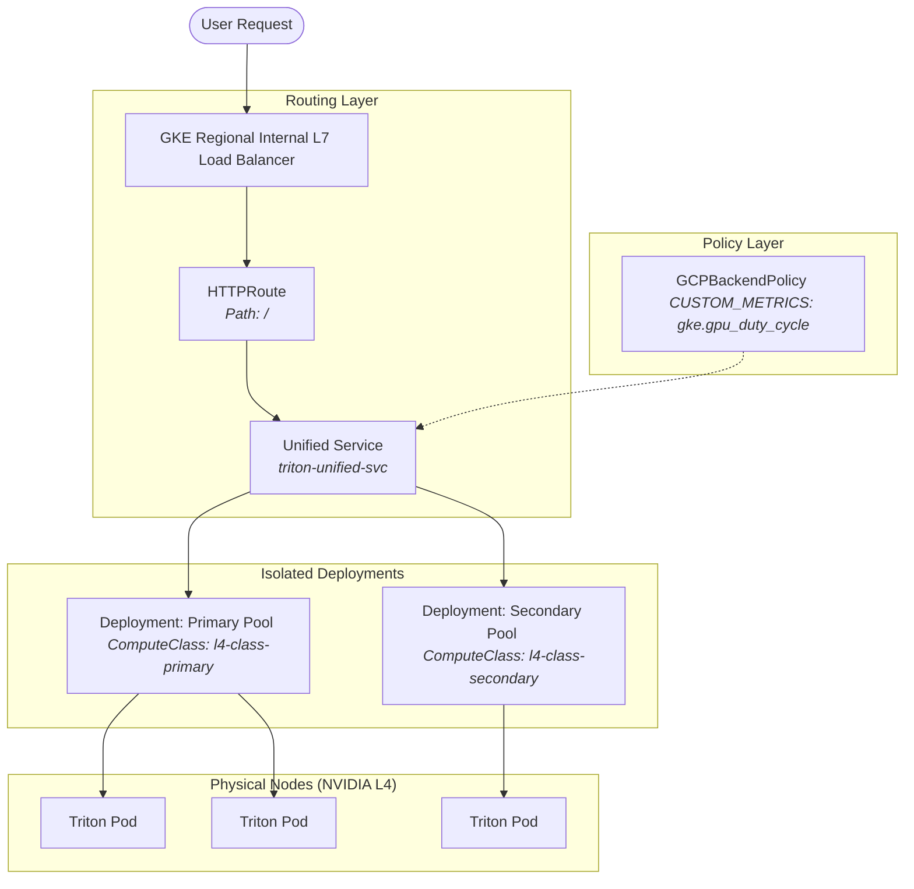

# Architecture and Scaling Considerations

## 1. The Logic of a Unified Service for Active-Active AI Routing

When managing AI inference workloads, ensuring high availability (HA) against physical hardware stockouts is paramount. Instead of relying on a single deployment that might fail to scale if a specific GCP zone runs out of GPUs, this architecture utilizes multiple isolated nodepools managed by a single intelligent Load Balancer.

**The Solution: Independent Deployments, Unified Service**
1.  **Strict ComputeClasses:** We define `l4-class-primary` and `l4-class-secondary` with `whenUnsatisfiable: DoNotScaleUp`. This guarantees that each nodepool strictly provisions the exact hardware we expect (e.g., `g2-standard-4`).
2.  **Isolated Deployments:** We deploy `Deployment-L4-Primary` and `Deployment-L4-Secondary`. Their respective HPAs scale them entirely independently based on load. If one zone suffers a stockout, its HPA simply stops scaling, while the other continues.
3.  **Unified Service:** Both deployments share a common label (`shared-app: triton-inference`). A single Kubernetes `Service` selects this label, combining all pods across all pools into a massive unified backend.
4.  **Intelligent Routing (UBB):** We apply a `GCPBackendPolicy` utilizing **Utilization-Based Balancing (UBB)** directly to this unified service. The Regional Load Balancer natively reads the `gke.gpu_duty_cycle` metric from every pod. It aggressively spreads incoming requests to the pods with the lowest utilization, enforcing an Active-Active distribution.

## 2. Dynamic Spreading Logic (Zonal NEG Aggregation)

Contrary to earlier assumptions, Utilization-Based Balancing (UBB) performs **Zonal-level Spreading**, not per-pod spreading.

### How Zonal Aggregation Works
1.  **Metric Aggregation:** GKE scrapes the `gke.gpu_duty_cycle` from every pod but aggregates them into a single metric per Zonal NEG (one per GCP zone).
2.  **Load Balancer Decision:** When a request arrives, the Regional Load Balancer compares the **average utilization** of each zone.
3.  **Zonal Overflow:** If `Zone-A` averages 81% and `maxUtilizationPercent` is 80%, the Load Balancer "overflows" new traffic to `Zone-B`. It **cannot** selectively pick an idle pod in `Zone-A` if other pods in that same zone are saturated.

### Recommendation: Zonal Isolation Strategy
If you intend to mix different GPU types (e.g., L4 and G4) in the same cluster:
*   **Isolate by Zone:** Use `ComputeClass` `zones` constraints or `nodeSelector` to place each hardware type in a separate GCP zone.
*   **Why it works:** By keeping fast and slow pods in different zones, you prevent "Metric Dilution." The Load Balancer can clearly see the performance difference between the Zonal NEGs and route traffic to the "Fast" zone when the "Slow" zone is saturated.
*   **Trade-off:** You sacrifice zonal HA for each specific hardware type (i.e., if Zone-A fails, all L4s are lost). For multi-zonal HA with mixed hardware, the **GKE Inference Gateway** is the required architectural path.

#### References for Zonal Limitations
*   [GKE Gateway API Concepts](https://cloud.google.com/kubernetes-engine/docs/concepts/gateway-api)
*   [GKE Network Endpoint Groups (NEGs)](https://cloud.google.com/kubernetes-engine/docs/how-to/standalone-neg) - Details the zonal nature of NEGs used by the Load Balancer.

## 3. Architecture Diagram


```mermaid
graph TD
    User([User Request]) --> Gateway[GKE Regional Internal L7 Load Balancer]
    
    subgraph RoutingLayer ["Routing Layer"]
        Gateway --> Route[HTTPRoute <br/><i>Path: /</i>]
        Route --> Service[Unified Service <br/><i>triton-unified-svc</i>]
    end

    subgraph PolicyLayer ["Policy Layer"]
        Policy[GCPBackendPolicy <br/><i>CUSTOM_METRICS: gke.gpu_duty_cycle</i>] -.-> Service
    end

    subgraph IsolatedDeployments ["Isolated Deployments"]
        Service --> DeployPrimary[Deployment: Primary Pool <br/><i>ComputeClass: l4-class-primary</i>]
        Service --> DeploySecondary[Deployment: Secondary Pool <br/><i>ComputeClass: l4-class-secondary</i>]
    end

    subgraph PhysicalNodes ["Physical Nodes (NVIDIA L4)"]
        DeployPrimary --> PodP1[Triton Pod]
        DeployPrimary --> PodP2[Triton Pod]
        DeploySecondary --> PodS1[Triton Pod]
    end
```

## 4. Scaling Considerations for RecML (DLRM)

Scaling inference servers (like NVIDIA Triton) running Deep Learning Recommendation Models (DLRM) requires careful resource allocation.

### The CPU Bottleneck Reality
While DLRMs execute matrix multiplications on the GPU, they are heavily reliant on the CPU for JSON payload parsing, HTTP connection handling, and tensor formatting.
*   **The Problem:** If you assign only `500m` CPU to a Triton pod, a burst of parallel HTTP requests will saturate the CPU instantly. The Gateway will return `504 Gateway Timeout` errors before the GPU even has a chance to process the data.
*   **The Solution:** Align pod resources with the physical node limits. By assigning `4 CPU` and `8Gi RAM` to the pods (matching the `g2-standard-4` node), and configuring Triton's `instance_group` to `count: 4`, the pod can easily process massive parallel bursts and feed the GPU efficiently.

### Choosing the Right HPA Metric
*   **GPU Duty Cycle:** The `gke.gpu_duty_cycle` is excellent for UBB routing because it represents the actual saturation of the CUDA cores.
*   **CPU Utilization (Current HPA Setup):** Because DLRMs are so CPU-intensive during the HTTP/JSON phase, scaling on CPU utilization (e.g., target 70%) is incredibly fast and reliable. As traffic bursts, the CPU spikes first, triggering rapid HPA scale-ups that provision new nodes before the GPU completely locks up.

## 5. Verification & Troubleshooting Commands

### Hardware Verification
To verify that your pod is actually utilizing the specific GPU family defined in your `ComputeClass`:

```bash
# Check the Primary Pod GPU
kubectl exec $(kubectl get pods -l app=triton-l4-primary -o name | head -n 1) -c triton -- nvidia-smi

# Check the Secondary Pod GPU
kubectl exec $(kubectl get pods -l app=triton-l4-secondary -o name | head -n 1) -c triton -- nvidia-smi
```

### Scaling Verification
To see why a pod is stuck in `Pending` (crucial for detecting physical hardware stockouts):

```bash
# View autoscaler decision logs (Look for RESOURCE_POOL_EXHAUSTED)
kubectl get events -n kube-system --sort-by='.lastTimestamp'

# View HPA metrics calculation
kubectl describe hpa triton-l4-primary-hpa
```